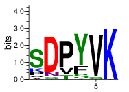

```{r setup, include=FALSE}
knitr::opts_chunk$set(echo = TRUE)
```

## Summary
Synaptotagmin is a protein involved with the fusion of synaptic vessicles with the outer membrane. Mutations in a highly conserved sequence within the C2A and C2B domains are fatal in drosophila unless the calcium concentration is dramatically increased. To investigate the mechanism by which these mutations disrupt the function of synaptotagmin, we ran accelerated molecular dynamics simulations on the isolated C2A and C2B domains. We assesed the stability of the Calcium binding pocket formed by loops 1 and 3 by measuring the volume of the pocket, the secondary structure of the loops, and principle component analysis. 

## Introduction
### Synaptotagmin 
Synaptotagmin is a Ca2+ sensing protein, essential for life, involved in the exocytosis of synaptic vesicles through interaction with the SNARE (soluble N-ethylmaleimide-sensitive factor attachment protein receptor) complex. Synaptotagmin binds calcium in a cup like formation and subsequently embeds itself in the target membrane through interactions with hydrophobic residues on loops 1 and 3. Fatal AD3 mutations in Drosophila are hypothesized to destabilize loop 3 and interfere with its ability to bind Ca2+. The mechanism by which these AD3 mutations induce loss of function in synaptotagmin can be elucidated through the use of computational methods and accelerated molecular dynamics.

### Accelerated dynamics 
Computational methods, and accelerated molecular dynamics simulations in particular, are able to model the behavior of proteins with less computational cost than unaccelerated dynamics. Accelerated dynamics reduce the simulation time by sampling the proteins configuration space more broadly. The accelerated model removes barriers in the protein's energy landscape by reducing the depth of local energy minima below a certain threshold, resulting in enhanced sampling.  In this study, we have used accelerated molecular dynamics to simulate the effect of the mutations 180Y to 180F and 180Y to 180N on the stability of synaptotagmin C2A on the timescale of 100 nanoseconds, and also simulated the wild type (PDB 4wee) for comparison.

### AD3 Mutation


## Setup
### Beta sheet stability 
For these runs we tested the stability of C2A with several alpha and Talpha values under normal and dual
acceleration.The hydrogen bonds formed between beta sheets were recorded at each frame and plotted into histograms. The protein was melting with `accelMDalpha 100`, `accelMDTalpha 4560`, and `accelMDdual on`; however, the data for this still needs to be analyzed.

    # select the beta sheets and count their hydrogen bonds
    set sel1 [atomselect top "(resid 144 to 152 or resid 156 to 166 or resid 178 to 186 or resid 207 to 213 or resid      223 to 231 or resid 237 to 246 or resid 256 to 261) and protein and backbone"]
    hbonds -sel1 $sel1 -writefile yes 

#### Histogram of hydrogen bond data
```{r echo=FALSE, message=FALSE}
source("./plots/hbonds_histogram.R")
```

#### Hydrogen bond behavior over time

```{r echo=FALSE, message=FALSE, warning=FALSE}
source("./plots/hbonds_line.R")
```

### namd configuration
Based on our analysis of the hydrogen bonding across different acceleration parameters, we decided to use `alpha=200` and `dual=off` in our final runs. We used our lab's crystal structure of synaptotagmin C2A and C2B to generate the mutants of interest with pymol's mutagenesis wizard. Each of the 6 resulting structures was run under different random seeds for 50,000,000 frames with a timestep of 2 femtoseconds (total of 100 ns) on lonestar 5. The pdb structures were solvated and ionized in a cube and minimized for 1000 frames. A single atom in the center of the protein was restrained to prevent drifting. 

## Methods
### Webplot and alignment
The alignment of synaptotagmin-1 through synaptotagmin-17 was computed with mafft. A python script `cut.py` was used to cut the alignment down to the region in which the AD3 mutation lies. The regions in the alignemt are location `352-357` in C2A and `510-516` in C2B. Mutations in this sequence (SDPYVK) are fatal and therefore it is highly conserved across all C2 domains. This indicates that the 6 residue sequence plays an important structural role in the protein and its ablility to interact with calcium.




### Principle component analysis

### Distance analysis
In an attempt to measure the stability of loop-3, we computed the distance between the apical c alphas of loop 1 and loop 3. For C2A we selected residues 173 and 276, and for C2B residues 305 and 364. The script that computes the distance analysis can be found [here](https://github.com/prockresearch/AD3_syt_sim/blob/master/analysis/distance.py)

```{r echo=FALSE, message=FALSE, warning=FALSE}
source("./plots/distance_density.R")
```

### Volume analysis
The volume of the pocket between loops 1 and 3 was defined by 3 c alphas on each loop for a total of 6. The volume of the pocket was defined as the convex hull of these 6 c alphas. The script that computes the volume analysis can be found [here](https://github.com/prockresearch/AD3_syt_sim/blob/master/analysis/volume.py)

```{r echo=FALSE, message=FALSE, warning=FALSE}
source("./plots/volume_density.R")
```

### RMSD and RMSF

### Ramachandran

## Links
1. [Accelerated dynamics](http://www.ks.uiuc.edu/Research/namd/2.9/ug/node63.html)
2. [Bio3D](http://thegrantlab.org/bio3d/index.php)
3. [MDAnalysis](http://www.mdanalysis.org/)
4. [Structure of human synaptotagmin 1 C2AB in the absence of Ca2+ reveals a novel domain association.](http://www.ncbi.nlm.nih.gov/pubmed/17956130)
5. [Molecular dynamics study of the opening mechanism for DNA polymerase I.](http://www.ncbi.nlm.nih.gov/pubmed/25474643)
6. [The effect on synaptic physiology of synaptotagmin mutations in Drosophila.](http://www.ncbi.nlm.nih.gov/pubmed/7909234)
7. [ggplot](http://ggplot2.org/)
