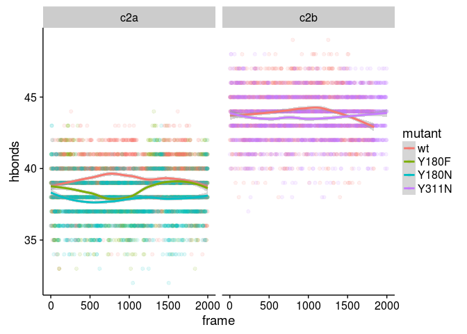

AD3 Synaptotagmin
================
Patrick Rock
June 17, 2016

-   [Introduction](#introduction)
    -   [Synaptotagmin summary](#synaptotagmin-summary)
    -   [Accelerated dynamics summary](#accelerated-dynamics-summary)
-   [Methods](#methods)
    -   [Beta sheet stability](#beta-sheet-stability)
    -   [Webplot and alignment](#webplot-and-alignment)
-   [References](#references)

Introduction
============

Synaptotagmin summary
---------------------

Synaptotagmin is a Ca2+ sensing protein, essential for life, involved in the exocytosis of synaptic vesicles through interaction with the SNARE (soluble N-ethylmaleimide-sensitive factor attachment protein receptor) complex. Synaptotagmin binds calcium in a cup like formation and subsequently embeds itself in the target membrane through interactions with hydrophobic residues on loops 1 and 3. Fatal AD3 mutations in Drosophila are hypothesized to destabilize loop 3 and interfere with its ability to bind Ca2+. The mechanism by which these AD3 mutations induce loss of function in synaptotagmin can be elucidated through the use of computational methods and accelerated molecular dynamics.

Accelerated dynamics summary
----------------------------

Computational methods, and accelerated molecular dynamics simulations in particular, are able to model the behavior of proteins with less computational cost than unaccelerated dynamics. Accelerated dynamics reduce the simulation time by sampling the proteins configuration space more broadly. The accelerated model removes barriers in the protein's energy landscape by reducing the depth of local energy minima below a certain threshold, resulting in enhanced sampling. In this study, we have used accelerated molecular dynamics to simulate the effect of the mutations 180Y to 180F and 180Y to 180N on the stability of synaptotagmin C2A on the timescale of 100 nanoseconds, and also simulated the wild type (PDB 4wee) for comparison.

Methods
=======

Beta sheet stability
--------------------

For these runs we tested the stability of C2A with several alpha and Talpha values under normal and dual acceleration.The hydrogen bonds formed between beta sheets were recorded at each frame and plotted into histograms. The protein was melting with `accelMDalpha 100`, `accelMDTalpha 4560`, and `accelMDdual on`; however, the data for this still needs to be analyzed.

    # select the beta sheets and count their hydrogen bonds
    set sel1 [atomselect top "(resid 144 to 152 or resid 156 to 166 or resid 178 to 186 or resid 207 to 213 or resid 223 to 231 or resid 237 to 246 or resid 256 to 261) and protein and backbone"]
    hbonds -sel1 $sel1 -writefile yes 

Webplot and alignment
---------------------

The alignment of synaptotagmin-1 through synaptotagmin-17 was computed with mafft. A python script `cut.py` was used to cut the alignment down to the region in which the AD3 mutation lies. The regions in the alignemt are location `352-357` in C2A and `510-516` in C2B.

References
==========

1.  [Accelerated dynamics](http://www.ks.uiuc.edu/Research/namd/2.9/ug/node63.html)
