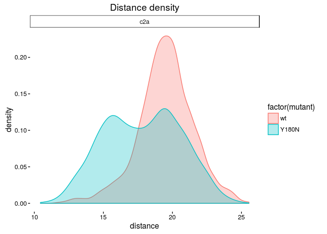

#### Project Description

I am investigating the effect of mutations at the AD3 locus on the
dynamics of synaptotagmin C2A and C2B by using the namd simulation tool
to generate accelerated molecular dynamics trajectories, and analyzing
the output with a series of python scripts. Austin Meyer, PhD, MS3,
Roger B. Sutton, PhD, and I are the only people at the health science
center doing molecular dynamics. A more detailed description of the
project along with the code behind it can be found at
<https://github.com/prockresearch/AD3_syt_sim>

#### Summer Progress

This summer, following Dr. Sutton’s instructions, I’ve run molecular
dynamics simulations on Synaptotagmin and performed several forms of
analysis on the resulting trajectories. I’ve built an automation tool
for accelerating namd job deployment. I developed an analysis framework
that extends data management and parallel functionality automatically to
all metrics we use, resulting in a computational speed up by a factor of
sixteen. The analysis code is written in python and is hosted
[here](https://github.com/prockresearch/AD3_syt_sim/tree/master/analysis).
Included among the forms of analysis I wrote are: I set up and ran over
10,000 hours of simulation on the lonestar5 supercomputer in Austin. I
also wrote ggplot scripts to visualize all analysis data.

#### Future Objectives

Continuing on from this summer, I hope to polish and complete the work
I’ve done for publication. I plan to extend my work on synaptotagim to
dysferlin, a homologous protein, with the intent of elucidating the
mechanism in which C2 mutations lead to dysferlinopathies in humans.
Limb-girdle muscular dystrophy is an example of a dysferlinopathy that
we have studied in medical school. I have the opportunity to investigate
the etiology and pathogenesis of this condition using the techniques
that I have learned this summer.
